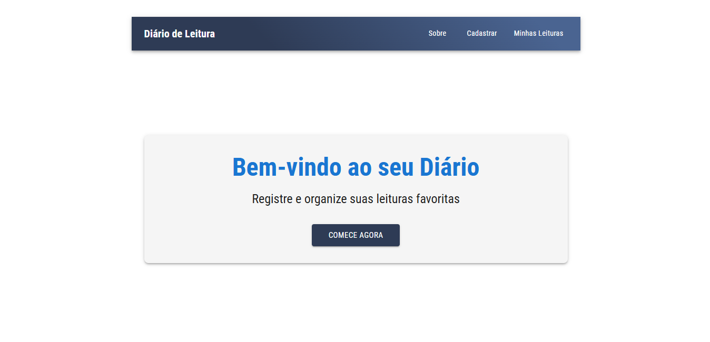
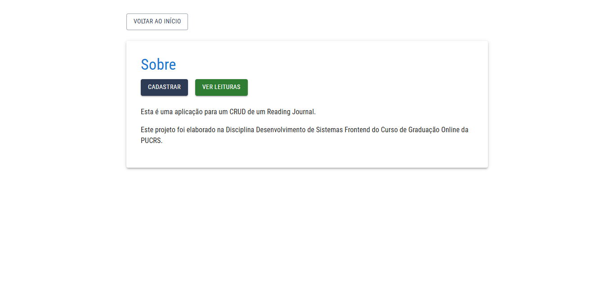
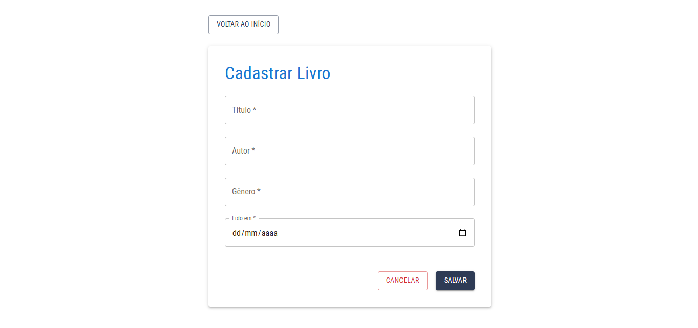
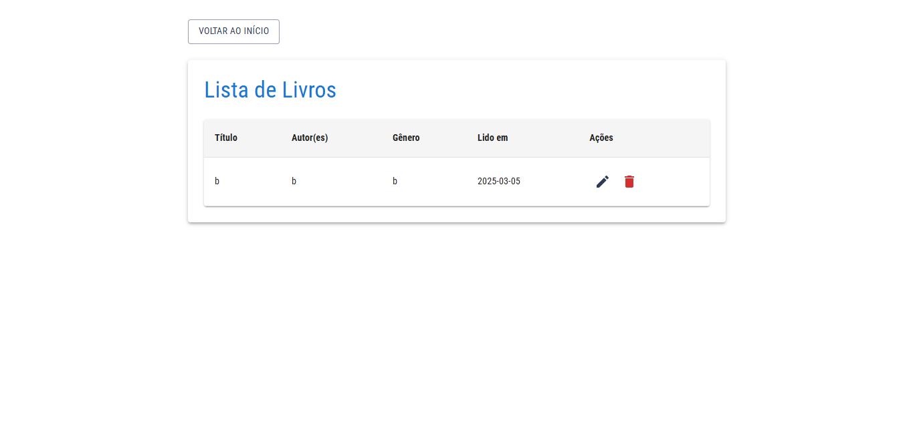
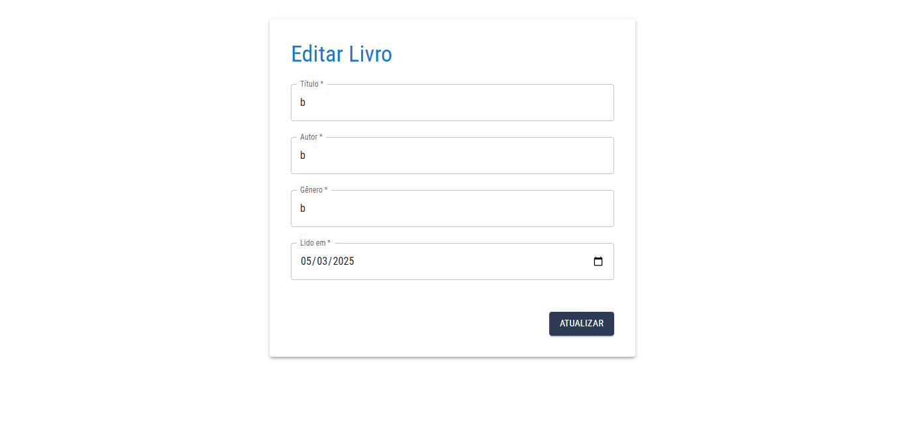

## Diário de Leitura - CRUD Frontend

<Descrição-do-Projeto>

Este projeto é um sistema de gerenciamento de leituras (CRUD) desenvolvido como parte da disciplina Desenvolvimento de Sistemas Frontend do Curso de Graduação Online da PUCRS. A aplicação permite cadastrar, listar, editar e excluir livros lidos, funcionando como um diário de leitura pessoal.

## Tecnologias Utilizadas

    React.js

    Material-UI (MUI)

    React Router

    Axios

    JSON Server (API mock)

    Jest (testes unitários)

<Como-Executar-o-Projeto-Pré-requisitos>

    Node.js (versão 16 ou superior)

## Passo a Passo

    Clonar o repositório utilize git ou apenas baixa o zip
    git clone [URL_DO_REPOSITORIO]
    
    Instalar dependências
    npm install

    Iniciar o servidor JSON (API mock), em um terminal separado execute:
    npx json-server --watch db.json --port 5000

    Iniciar a aplicação React
    npm start

    Para acessar a aplicação abra o navegador e acesse:
    http://localhost:3000

<Estrutura-do-Projeto-Componentes-Principais>

    Header

        °Barra de navegação superior com links para as principais páginas

    BookForm

        °Formulário reutilizável para cadastro e edição de livros

        °Validação de campos obrigatórios

    BookList

        °Tabela que exibe todos os livros cadastrados

        °Funcionalidades de edição e exclusão

    Notification

        °Componente de notificação para feedback das ações

    Pages

        °Home: Página inicial com chamada para ação

        °About: Página com informações sobre o projeto

        °Register: Página de cadastro de novos livros

        °List: Página que lista todos os livros cadastrados

        °Edit: Página para edição de livros existentes

    Serviços

        °api.js: Configuração do Axios e métodos para comunicação com a API

## Testes

O projeto inclui testes unitários para os principais componentes. Para executar os testes:
npm test

## 📸 Screenshots

### Página Inicial

## Pagina Sobre

## Pagina Cadastro

## Pagina das Leituras

## Pagina de Edição

## Ricardo Henrique Lobo Barreto Machado da Silva
Curso: Desenvolvimento de Sistemas FrontEnd PUCRS